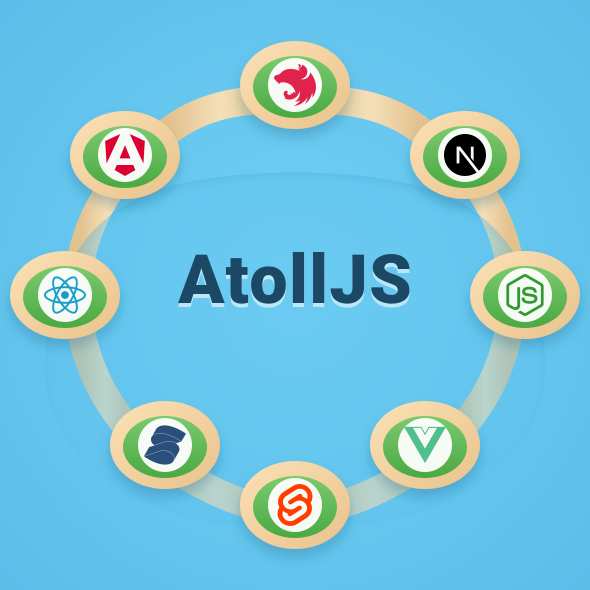

<picture>
  <source media="(prefers-color-scheme: dark)" srcset="assets/atoll-dark.svg" />
  <source media="(prefers-color-scheme: light)" srcset="assets/atoll-light.svg" />
  
</picture>

# AtollJS

[](https://github.com/jwhenry3/atolljs/actions/workflows/ci.yml)
[](https://codecov.io/gh/jwhenry3/atolljs)

Typed shared-memory worker pools for TypeScript — deterministic `SharedArrayBuffer`
layouts, first-class task methods, and cross-thread reactive state. A worker
atoll: pools and shared workers joined to your app through one shared-memory
fabric, so work is offloaded as typed method calls while large state stays put
(zero-copy, no postMessage serialization of the values themselves).

**[Atoll — package documentation](https://jwhenry3.github.io/atolljs/consumer/quickstart/)**

## Install

```bash
npm install @atolljs/core            # the whole SDK
npm install @atolljs/react           # + one framework binding, if you use one
```

Framework bindings are published independently — install only the one you use.

## Quickstart

A minimal counter — one shared field, one worker method, one component.
Four files, and the method name is written exactly once.

```ts
// counter.memory.ts — shared memory, imported by both threads
import { defineSharedMemory, field } from '@atolljs/core';

export const counterMemory = defineSharedMemory({
  count: field.number(),
});
```

```ts
// counter.worker.ts — the worker entry; methods live here
import { defineWorker } from '@atolljs/core';
import { counterMemory } from './counter.memory';

export const counterWorker = defineWorker({
  sharedMemory: counterMemory,
  methods: {
    increment(delta: number) {
      const next = counterMemory.count.read() + delta;
      counterMemory.count.write(next);  // write in place — no postMessage
      return next;
    },
  },
});
export type CounterWorker = typeof counterWorker;
```

```ts
// counter.ts — the typed client; import type only, no worker code in this bundle
import { connectWorker } from '@atolljs/core';
import { counterMemory } from './counter.memory';
import type { CounterWorker } from './counter.worker';

export const counter = connectWorker<CounterWorker>({
  sharedMemory: counterMemory,
  // Inline new Worker(new URL(..., import.meta.url)) — every bundler's
  // worker transform can see the entry point this way.
  worker: () => new Worker(new URL('./counter.worker.ts', import.meta.url), { type: 'module' }),
  poolSize: 'auto',   // navigator.hardwareConcurrency, or pass a number
});
// counter.increment(1) → Promise<number>. The pool spawns on first call
// (SSR-safe to import); counter.terminate() tears it down.
```

```tsx
// App.tsx — bind it in your framework
import { useSharedValue, useTask } from '@atolljs/react';
import { counterMemory } from './counter.memory';
import { counter } from './counter';

export function App() {
  const count = useSharedValue(counterMemory, 'count');
  const increment = useTask(counter.increment);   // latest-wins task state
  return <button onClick={() => increment.run(1)}>count: {count ?? '…'}</button>;
}
```

`increment.run(1)` posts the call to a worker, the worker writes `count` in
place, and the binding re-renders on the next field write.

Shared memory is opt-in: leave `sharedMemory` out of both `defineWorker` and
`connectWorker` and you get a typed, pooled, cancellable worker RPC that runs
anywhere Workers do — no isolation headers needed. With shared memory,
`SharedArrayBuffer` requires
[cross-origin isolation headers](https://jwhenry3.github.io/atolljs/consumer/hosting/)
(COOP/COEP) in the browser; Node needs nothing.

## Packages

`@atolljs/core` is the SDK; everything else is independently published —
install only what you use.

### Framework bindings

| Framework | Package | What it is | Docs |
|---|---|---|---|
| React | [`@atolljs/react`](https://www.npmjs.com/package/@atolljs/react) | Hooks — `useObservable`, `useSharedValue`, `useTask` | [React guide](https://jwhenry3.github.io/atolljs/consumer/fw-react/) |
| Vue | [`@atolljs/vue`](https://www.npmjs.com/package/@atolljs/vue) | Composables — `useObservable`, `useSharedValue`, `useTask` | [Vue guide](https://jwhenry3.github.io/atolljs/consumer/fw-vue/) |
| SolidJS | [`@atolljs/solidjs`](https://www.npmjs.com/package/@atolljs/solidjs) | Primitives — `createObservable`, `createSharedValue`, `createTask` | [SolidJS guide](https://jwhenry3.github.io/atolljs/consumer/fw-solid/) |
| Svelte | [`@atolljs/svelte`](https://www.npmjs.com/package/@atolljs/svelte) | Svelte 5 rune bindings — `observableValue`, `sharedValue`, `taskState` | [Svelte guide](https://jwhenry3.github.io/atolljs/consumer/fw-svelte/) |
| Angular | [`@atolljs/angular`](https://www.npmjs.com/package/@atolljs/angular) | Signals + DI — `observableSignal`, `sharedValue`, `taskState`, `provideAtoll` | [Angular guide](https://jwhenry3.github.io/atolljs/consumer/fw-angular/) |
| Next.js | [`@atolljs/nextjs`](https://www.npmjs.com/package/@atolljs/nextjs) | Client-component bindings (React re-export) | [Next.js guide](https://jwhenry3.github.io/atolljs/consumer/fw-nextjs/) |
| NestJS | [`@atolljs/nestjs`](https://www.npmjs.com/package/@atolljs/nestjs) | Server-side module/decorators for worker pools | [NestJS guide](https://jwhenry3.github.io/atolljs/consumer/fw-nestjs/) |

### Worker islands — render framework trees off the main thread

| Framework | Package | What it is | Docs |
|---|---|---|---|
| *(engine)* | [`@atolljs/islands`](https://www.npmjs.com/package/@atolljs/islands) | `mountIsland`, op protocol, proxy DOM, worker runtimes | [Worker islands](https://jwhenry3.github.io/atolljs/consumer/islands/) |
| React | [`@atolljs/react-island`](https://www.npmjs.com/package/@atolljs/react-island) | `<Island/>`, `islandComponent`, `lazyIsland` | [React islands](https://jwhenry3.github.io/atolljs/consumer/fw-react/worker-islands/) |
| Vue | [`@atolljs/vue-island`](https://www.npmjs.com/package/@atolljs/vue-island) | `useIsland`, `<AtollIsland>` + Vue worker renderer | [Vue islands](https://jwhenry3.github.io/atolljs/consumer/fw-vue/worker-islands/) |
| Svelte | [`@atolljs/svelte-island`](https://www.npmjs.com/package/@atolljs/svelte-island) | `use:island`, `createIslandState` + Svelte 5 worker renderer | [Svelte islands](https://jwhenry3.github.io/atolljs/consumer/fw-svelte/worker-islands/) |
| SolidJS | [`@atolljs/solid-island`](https://www.npmjs.com/package/@atolljs/solid-island) | `createIsland`, `Island`, `islandComponent`, `lazyIsland` + `solid-js/universal` worker renderer | [Solid islands](https://jwhenry3.github.io/atolljs/consumer/fw-solid/worker-islands/) |
| Angular | [`@atolljs/angular-island`](https://www.npmjs.com/package/@atolljs/angular-island) | `islandComponent` facades typed off `@AngularIsland` worker components, `<atoll-island>`/`[atollIsland]` + `Renderer2` worker renderer | [Angular islands](https://jwhenry3.github.io/atolljs/consumer/fw-angular/worker-islands/) |

### Runtimes

| Package | What it is | Docs |
|---|---|---|
| [`@atolljs/core`](https://www.npmjs.com/package/@atolljs/core) | Core SDK — `defineWorker`/`connectWorker` typed worker clients over `WorkerPool`, shared-memory contracts, `watch`/`observe`, codecs | [Quickstart](https://jwhenry3.github.io/atolljs/consumer/quickstart/) · [Shared memory](https://jwhenry3.github.io/atolljs/consumer/shared-memory/) · [Tasks](https://jwhenry3.github.io/atolljs/consumer/tasks/) |
| [`@atolljs/node`](https://www.npmjs.com/package/@atolljs/node) | `node:worker_threads` runtime adapter | [Tasks](https://jwhenry3.github.io/atolljs/consumer/tasks/) |

## Documentation

- **[Atoll — package documentation](https://jwhenry3.github.io/atolljs/consumer/quickstart/)** —
  the consumer-facing site: quickstart, API guides, framework pages, islands,
  hosting & headers.
- [`docs/`](docs/README.md) — in-repo documentation covering internals,
  contracts, islands, and per-framework bindings (agents: `AGENTS.md` points
  here before extensive work).

## Developing this repo

```
src/            core SDK — contract/ (shared protocol), pool/, worker/
packages/<fw>/      independently publishable framework bindings
packages/incidents/ demo domain package (contract + worker + pool)
examples/<fw>/      per-framework demo apps
docs/               in-repo markdown documentation (internals + bindings)
docs-consumer/      consumer docs site (deploys to GitHub Pages on main)
```

```bash
npm test            # vitest — all suites (sdk + packages + example e2e)
npm run build       # typecheck + lib build
npm run dev:all     # launch every example dev server
npm run build:pages # consumer docs + examples → dist-pages (GitHub Pages artifact)
```

Worker demos require cross-origin isolation (COOP/COEP) — the dev servers set it;
GitHub Pages cannot send headers, so the Pages artifact ships `coi-sw.js`, a
service worker that injects them (first visit reloads once; islands fall back to
their poll transport where isolation still isn't available).

### Releasing

Create a GitHub Release tagged `v<semver>` — `.github/workflows/publish.yml`
runs the full test suite, builds the core `dist`, stamps every publishable
package at the tag's version (lockstep; `packages/incidents` stays private),
and **stages** each to npm with provenance. Staged versions aren't
installable until a maintainer approves them — `npm stage list` /
`npm stage approve <stage-id>` (2FA at approval, not in CI), or the Staged
Packages tab on npmjs.com. Requires a granular `NPM_TOKEN` repo secret.
Preview the plan locally: `node scripts/publish.mjs v0.1.0 --dry-run` —
it lists the exact tarball contents (`npm pack --dry-run`) and the stage
commands, with nothing written or published. The workflow run ends with a
step-summary table of every package staged and its result; each publishable
manifest also pins `publishConfig.registry` to `registry.npmjs.org`, so the
destination is declared in the repo rather than resolved from the
publisher's local npmrc.

Staging needs each package to already exist on the registry, so the first
release is a manual bootstrap — from the repo root:

```bash
npm login                                    # once
npm ci && npx vite build && npx tsc -p tsconfig.build.json
node scripts/publish.mjs 0.1.0 --direct      # prompts for 2FA per package
```

Once every package exists, release-driven `npm stage publish` works for
every subsequent version.

#### Trusted publishing (OIDC)

Prefer OIDC over the `NPM_TOKEN` secret — no long-lived credential, and a
trust relationship can be **stage-only** so the workflow can't direct-publish
even if compromised. Configure per package (needs the package to exist on
npm, and npm CLI ≥ 11.10):

```bash
for p in core node react vue solidjs svelte angular nextjs nestjs \
         islands react-island vue-island svelte-island solid-island angular-island; do
  npm trust github "@atolljs/$p" --repo jwhenry3/atolljs --file publish.yml --allow-stage-publish -y
  sleep 2
done
```

Omit `--allow-publish` — stage-only. First call prompts for 2FA; choose
"skip for 5 minutes" and the loop finishes hands-free. Verify with
`npm trust list @atolljs/core`. Once every package shows the relationship,
delete the `NODE_AUTH_TOKEN` env line in `publish.yml` (npm only uses OIDC
when no token is present) — the secret can be revoked after.
